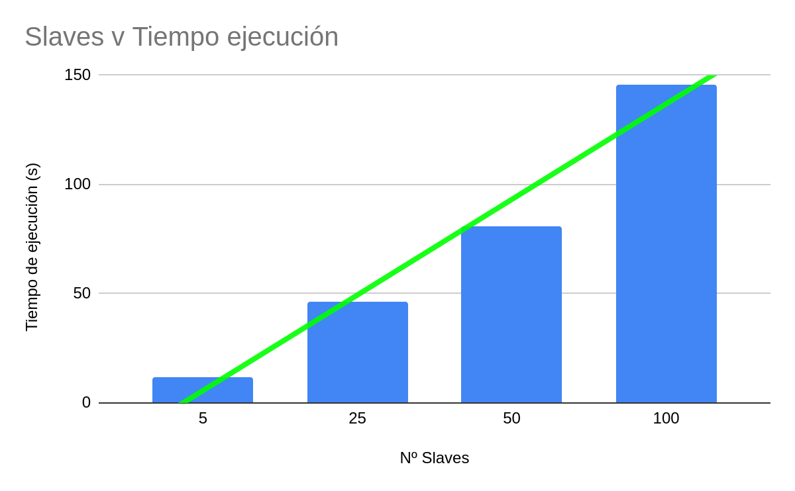

# SD-p2-Ruda-Soria
Practica 2 - Sistemes distribuits

### Autores: Martín Ruda Gazcón Aráoz, Sergi Soria Flores

## Nuestra Solución
Para realizar esta práctica hemos seguido la estructura dada en el enunciado. Por eso las funciones que hemos utilizado son las siguientes: 

### Main:
Cargamos la configuración del ibm_cos, usamos la función map para iniciar todos los slaves, la función call_async para iniciar la función master y por último obtenemos el resultado de esta función (La lista de permisos) y comprobamos que sea correcto comparándolo con el objeto result.json.

### Slave:
Cada slave lo que hace es escribir en el cos un objeto con el nombre p_write_(id del slave), una vez hecho esto entran en un bucle en el cual estarán mirando cada X segundos que en el bucket haya un objeto con el nombre de write_(id del slave), una vez este objeto esté presente, el slave coje el archivo result.json, le añade un línea con su id y vuelve a ponerlo en el bucket.
Una vez hecho esto la ejecución de ese slave habrá terminado.

### Master:
Esta función lee todos los ficheros p_write_id que han creado los slaves y los ordena por orden de creación. Una vez hecho esto coje el primer objeto de la lista y dependiendo del id que contenía escribe en el bucket un objeto llamado write_(mismo id del objeto previamente cojido de la lista), así dando permisos de escritura al slave correspondiente, luego elimina ese objeto de la lista del bucket y guarda el id que tenia en la lista (write_permission_list), una vez hecho esto espera a que el fichero result.json sea modificado por un slave, y una vez este ha sido modificado borra el objeto write_(id) que había creado previamente, este proceso se ejecuta hasta que no queden más objetos p_write_(id) en el Bucket. Finalmente esta función retornará la write_permission_list.

###  dataBucket:
Esta función borra todo el contenido del bucket.
### Librerías Usadas:
re: Para obtener el id de los strings p_write_id

json: Para leer y escribir el fichero result.json

## Juego de pruebas
| Slaves | result.json  | write_permission_list  | resultado
| :-:    | :-----------------------: | :-----------------------: | :---------:
| 5      | ['2', '4', '1', '0', '3'] | ['2', '4', '1', '0', '3'] | Correcto
| 25     | ['17', '3', '7', '9', '10', '6', '22', '12', '20', '18', '1', '16', '21', '2', '8', '13', '15', '19', '24', '14', '11', '4', '5', '0', '23'] | ['17', '3', '7', '9', '10', '6', '22', '12', '20', '18', '1', '16', '21', '2', '8', '13', '15', '19', '24', '14', '11', '4', '5', '0', '23'] | Correcto
| 50     | ['7', '13', '29', '1', '16', '33', '18', '2', '4', '21', '10', '26', '3', '17', '5', '9', '30', '15', '34', '12', '0', '35', '11', '14', '8', '19', '41', '27', '37', '36', '25', '32', '28', '48', '46', '31', '20', '39', '49', '43', '47', '45', '6', '42', '44', '24', '23', '40', '22', '38'] | ['7', '13', '29', '1', '16', '33', '18', '2', '4', '21', '10', '26', '3', '17', '5', '9', '30', '15', '34', '12', '0', '35', '11', '14', '8', '19', '41', '27', '37', '36', '25', '32', '28', '48', '46', '31', '20', '39', '49', '43', '47', '45', '6', '42', '44', '24', '23', '40', '22', '38'] | Correcto
| 100      | ['1', '10', '11', '17', '0', '32', '12', '15', '7', '3', '39', '2', '35', '19', '40', '41', '27', '24', '9', '22', '21', '14', '5', '13', '20', '4', '16', '8', '38', '28', '37', '23', '6', '26', '34', '18', '30', '49', '33', '36', '25', '55', '50', '61', '43', '69', '48', '31', '29', '44', '42', '94', '90', '98', '97', '52', '56', '53', '45', '59', '54', '57', '60', '73', '46', '58', '75', '47', '66', '79', '70', '63', '78', '64', '68', '74', '81', '65', '80', '91', '71', '86', '67', '51', '62', '95', '82', '99', '72', '96', '77', '76', '83', '85', '93', '89', '92', '87', '84', '88'] | ['1', '10', '11', '17', '0', '32', '12', '15', '7', '3', '39', '2', '35', '19', '40', '41', '27', '24', '9', '22', '21', '14', '5', '13', '20', '4', '16', '8', '38', '28', '37', '23', '6', '26', '34', '18', '30', '49', '33', '36', '25', '55', '50', '61', '43', '69', '48', '31', '29', '44', '42', '94', '90', '98', '97', '52', '56', '53', '45', '59', '54', '57', '60', '73', '46', '58', '75', '47', '66', '79', '70', '63', '78', '64', '68', '74', '81', '65', '80', '91', '71', '86', '67', '51', '62', '95', '82', '99', '72', '96', '77', '76', '83', '85', '93', '89', '92', '87', '84', '88'] | Correcto

Aquí podemos observar que el algoritmo es escalable, ya que al aumentar los slaves el tiempo se incrementa linealmente.

## Preguntas sobre exclusión mutua
### a. Many distributed algorithms such as the one proposed in this assignment require the use of a master or coordinator process. To what extent can such algorithms actually be considered distributed? Discuss 

Pueden ser considerados distribuidos en el sentido de que distribuimos las tareas en diferentes nodos. No se podría considerar estrictamente distribuido, ya que el paradigma master/slave es centralizado por lo que cada nodo de nuestro sistema no es independiente, sino que depende de un master que le permite realizar operaciones, y también del tiempo de ejecución de los otros nodos. Así también tenemos un solo punto de fallo, y un cuello de botella al usar la red (en nuestro caso el bucket) para coordinarse.

### b. Now suppose that the master function crashes. Does this always violate the correctness of the algorithm? If not, under what circumstances does this happen? Is there any way to avoid the problem and make the system able to tolerate coordinator crashes? Discuss 

Si tenemos un fallo en el master, el funcionamiento del algoritmo se puede corromper si la ejecución falla antes de que se pueda eliminar el permiso de escritura de la lista del master (p_write_id) ya que el bucle del master entonces nunca terminaría. 

Esto lo podríamos evitar haciendo que cada nodo se autogestione el borrado de permisos.

### c. In the proposed algorithm, write permissions are granted in the order in which are requested, so no slave function waits forever (no starvation). If the master function chose the slaves functions randomly, then could slave functions suffer from starvation?

No, ya que al ir eliminando las peticiones de los slaves del bucket al final vamos a terminar seleccionando todos los slaves. El peor caso del FIFO sería que un slave tendría que esperar a otros 99 slaves, que es el mismo caso que si lo hacemos al azar.

## Referencias

https://github.com/pywren/pywren-ibm-cloud

https://github.com/JosepSampe/pywren-ibm-cloud

## Repartición de tareas
La repartición de tareas ha sido equitativa ya que hemos realizado todo el trabajo juntos.
